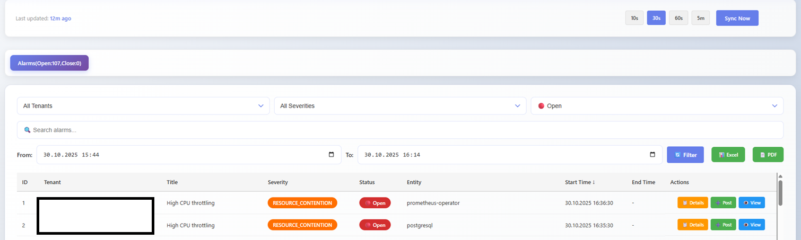
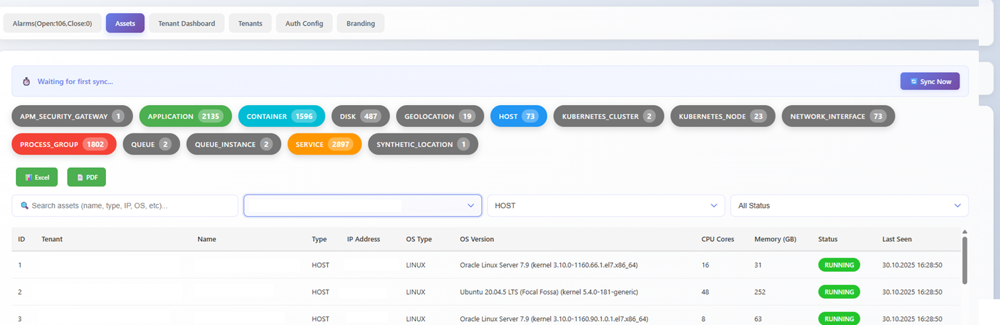

# 🧠 Dynatrace Multi-Tenant Monitoring App – Centralized Alarm & Asset Management

A **centralized monitoring solution for Dynatrace** that enables organizations to manage **multiple tenants, alarms, and assets** in one unified platform.  
Built for **DevOps teams and IT administrators** who need real-time visibility, alert synchronization, and comprehensive asset tracking across multiple Dynatrace environments.

---

## 🚀 Quick Start
For more help, see [INSTALLATION_GUIDE.md](./INSTALLATION_GUIDE.md)

## 🎯 Overview

This application enables organizations to:
- **Monitor Multiple Tenants**: Manage alarms and assets across different Dynatrace environments
- **Centralized Dashboard**: View tenant-specific dashboards with key metrics
- **Real-time Alerts**: Track open and closed alarms with detailed information
- **Asset Management**: Monitor and manage infrastructure assets
- **Comment System**: Add and manage comments on problems for collaboration
- **Multi-format Export**: Export data to Excel and PDF formats
- **Advanced Filtering**: Filter alarms and assets by multiple criteria
- **User Management**: Role-based access control with admin and user roles

## ✨ Key Features

### Alarm Management
- Real-time alarm synchronization from Dynatrace
- Filter by severity, status, tenant, and date range
- Sort by any column (ascending/descending)
- Search across all alarm fields
- Post, view, and edit comments on alarms
- Export alarms to Excel and PDF

### Asset Management
- Track infrastructure assets (hosts, services, databases, etc.)
- Dynamic asset type filtering
- Search across asset properties
- Asset type distribution analytics
- Tenant-specific asset views

### Tenant Dashboard
- Key metrics and statistics
- Asset type distribution chart
- 7-day alarm trend analysis (Open/Closed)
- Recent alarms overview
- Tenant-specific filtering

### Authentication & Security
- JWT-based authentication
- Optional LDAP integration
- Role-based access control (Admin/User)
- Secure API endpoints

### Data Management
- Automatic data synchronization from Dynatrace
- Configurable sync intervals
- SQLite database for data persistence
- Data export capabilities

## 🏗️ Architecture

### Technology Stack

**Frontend:**
- React 19.1.1
- Vite 7.1.7
- Chart.js for data visualization
- Axios for API communication
- XLSX for Excel export
- jsPDF for PDF generation

**Backend:**
- Node.js with Express 5.1.0
- SQLite with Sequelize ORM
- JWT for authentication
- LDAP support (optional)
- Scheduled jobs for data sync

**Deployment:**
- Docker containerization
- Docker Compose for local development

## 📋 System Requirements

- Node.js 16+
- npm 8+
- Dynatrace account with API access
- 2GB RAM minimum
- 5GB storage for database

## 🔗 Useful Links
- [Dynatrace API Documentation](https://www.dynatrace.com/support/help/)
- [Official Docker Image](#)
- [Project Wiki](#)

## 🏷️ Keywords
Dynatrace monitoring, multi-tenant monitoring, centralized dashboard, alarm management, asset management, Node.js monitoring tool

